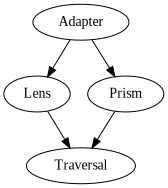

Profunctors and data accessors
==============================

------------------------------------------------------------------------

Data accessors - motivation
===========================

The problem:

Haskell doesn't have user friendly, available out of the box set of
features for modification and access of nested data structures.

Built-in record syntax is clunky to use and doesn't compose well.

Solution: lenses

...and adapters, prisms, traversals etc.

The whole family of these is known as optics.

------------------------------------------------------------------------

Data accessors - encodings
==========================

-   Concrete (tutorials)
    -   Easy to understand
    -   Don't compose well (what is composition of a lens and a prism?)
-   Van Laarhoven (lens library)
    -   Composable
    -   Lenses and traversals don't require anything other than base
        library
    -   Convoluted types
    -   The hierarchy of optics is not clear from the types
-   Profunctor (purescript-profunctor-lenses library)
    -   Composable
    -   Require profunctors
    -   Types still somewhat convoluted
    -   Hierarchy of optics is clear from the types

------------------------------------------------------------------------

Optics - adapter
================

    !haskell
    data Adapter a b s t = Adapter { from :: s -> a
                                   , to   :: b -> t
                                   }

    _text :: Adapter T.Text T.Text String String
    _text = Adapter T.pack T.unpack

-   Also known as Iso (lens library).
-   Provides a way to convert back and forth between the types.
-   Usually an isomorphism, although we don't enforce it here.

------------------------------------------------------------------------

Optics - lens
=============

Lens is a pair of two functions, a getter and a setter (updater).

    !haskell
    data Lens a b s t = Lens { view   :: s -> a
                             , update :: s -> b -> t
                             }

    _fst :: Lens a b (a, c) (b, c)
    _fst = Lens fst (\(_, c) b -> (b, c))

    _snd :: Lens a b (c, a) (c, b)
    _snd = Lens snd (\(c, _) b -> (c, b))

-   Allows us to
    -   view a value contained within a larger data structure,
    -   update a specific part of it.
-   Deals with product types.

------------------------------------------------------------------------

Optics - prism
==============

    !haskell
    data Prism a b s t = Prism { match :: s -> Either t a
                               , build :: b -> t
                               }

    _Left :: Prism a b (Either a c) (Either b c)
    _Left = Prism match Left
      where
        match (Left a)  = Right a
        match (Right t) = Left (Right t)

    _Right :: Prism a b (Either c a) (Either c b)
    _Right = Prism match Right
      where
        match (Left t)  = Left (Left t)
        match (Right a) = Right a

-   Allows us to
    -   match on a value possibly contained within a larger data
        structure,
    -   build the data structure back from a specific value.
-   Deals with sum types.

------------------------------------------------------------------------

Optics - traversal
==================

    !haskell
    type Traversal a b s t = forall f. Applicative f => (a -> f b) -> s -> f t

    traversed :: Traversable t => Traversal a b (t a) (t b)
    traversed = traverse

    both :: Traversal a b (a, a) (b, b)
    both t (a1, a2) = (,) <$> t a1 <*> t a2

-   Generalization of `traverse` from `Data.Traversable`.
-   Allows us to
    -   match and/or modify multiple values possibly contained within a
        larger data structure in a predefined order,
    -   apply effects specific to `f`.
-   Deals with a sequence of values of any type.

------------------------------------------------------------------------

Optics - hierarchy
==================

How do these optics relate to each other?

-   every Adapter is a Lens
-   every Adapter is a Prism
-   every Lens is a Traversal
-   every Prism is a Traversal

How can we see that? Also, how can we make these optics composable with each other?

------------------------------------------------------------------------

Profunctor
==========

Represented by a type class. In order to arrive at the definition, we
need to backtrack a little bit.

------------------------------------------------------------------------

Covariant functor
=================

A type class we all know and appreciate.

    !haskell
    class Functor (f :: Type -> Type) where
      fmap :: (a -> b) -> f a -> f b

-   Intuitively `f a` will **output** values of type `a` in a context specific
    to `f`.
-   `fmap` allows us to map over `f` to change the type of its **output**.
-   We say that the argument `a` in `f a` is covariant.

Examples: `Identity`, `Maybe`, `IO`, `Either a`.

------------------------------------------------------------------------

Contravariant functor
=====================

Significantly less popular.

    !haskell
    class Contravariant (f :: Type -> Type) where
      contramap :: (b -> a) -> f a -> f b

-   Intuitively `f a` will take values of type
    `a` as an **input** in a context specific to
    `f`.
-   `contramap` allows us to map over `f` to
    change the type of its **input**.
-   We say that the argument `a` in `f a` is
    contravariant.

Example:

    !haskell
    newtype Pred a = Pred { runPred :: a -> Bool }

    instance Contravariant Pred where
      contramap f (Pred p) = Pred (p . f)

    isEven :: Pred Int
    isEven = Pred ((== 0) . (`rem` 2))

    isLengthEven :: Pred String
    isLengthEven = contramap length isEven

------------------------------------------------------------------------

Profunctor
==========

    !haskell
    class Profunctor (p :: Type -> Type -> Type) where
      dimap :: (a' -> a) -> (b -> b') -> p a b -> p a' b'

- An instance of a profunctor is a type `p a b` where the first argument is
contravariant and the second argument is covariant.
- Intuitively it is a transformer that consumes values of type
`a` and produces values of type `b`.

Canonical example:

    !haskell
    instance Profunctor (->) where
      dimap i o f = o . f . i

More interesting example (foldl package):

    !haskell
    data Fold a b = forall s. Fold (s -> a -> s) s (s -> b)

    instance Profunctor Fold where
      dimap f g (Fold step begin extract) =
        Fold (\s a -> step s (f a)) begin (g . extract)

------------------------------------------------------------------------

Functors that went pro
======================

    !haskell
    newtype P1 a b = P1 (a -> (b, b))
    newtype P2 a b = P2 (a -> (Bool, b))
    newtype P3 a b = P3 (a -> ())

Which of the above are profunctors?

------------------------------------------------------------------------

Functors that went pro
======================

    !haskell
    newtype P1 a b = P1 (a -> (b, b))
    newtype P2 a b = P2 (a -> (Bool, b))
    newtype P3 a b = P3 (a -> ())

Which of the above are profunctors?

All of them:

    !haskell
    instance Profunctor P1 where
      dimap i o (P1 f) = P1 $ (\(b1, b2) -> (o b1, o b2)) . f . i

    instance Profunctor P2 where
      dimap i o (P2 f) = P2 $ (\(p, r) -> (p, o r)) . f . i

    instance Profunctor P3 where
      dimap i _ (P3 f) = P3 $ f . i

This can be generalized to any functor `f`:

    !haskell
    newtype Star f a b = Star { unStar :: a -> f b }

    instance Functor f => Profunctor (Star f) where
      dimap i o (Star f) = UpStar $ fmap o . f . i

----

Cartesian profunctors
========================

    !haskell
    class Profunctor p => Cartesian p where
      first  :: p a b -> p (a, c) (b, c)
      first = dimap swapP swapP . second

      second :: p a b -> p (c, a) (c, b)
      second = dimap swapP swapP . first

    instance Cartesian (->) where
      first :: (a -> b) -> (a, c) -> (b, c)
      first f = f `cross` id

    instance Functor f => Cartesian (Star f) where
      first :: Star f a b -> Star f (a, c) (b, c)
      first (Star f) = Star $ (\(fx, y) -> (, y) <$> fx) . (f `cross` id)

    -- Helpers

    swapP :: (a, b) -> (b, a)
    swapP (a, b) = (b, a)
    
    cross :: (a -> c) -> (b -> d) -> (a, b) -> (c, d)
    cross f g (x, y) = (f x, g y)

Intuitively a profunctor is cartesian if it can be extended with additional
context in the form of a pair.

----

Cocartesian profunctors
======================

    !haskell

    class Profunctor p => Cocartesian p where
      left :: p a b -> p (Either a c) (Either b c)
      left = dimap swapE swapE . right
    
      right :: p a b -> p (Either c a) (Either c b)
      right = dimap swapE swapE . left
    
    instance Cocartesian (->) where
      left :: (a -> b) -> Either a c -> Either b c
      left f = either (Left . f) Right
    
    instance Applicative f => Cocartesian (Star f) where
      left :: Star f a b -> Star f (Either a c) (Either b c)
      left (Star f) = Star $ either (fmap Left . f) (pure . Right)

    -- Helpers
    
    swapE :: Either a b -> Either b a
    swapE (Left a)  = Right a
    swapE (Right a) = Left a

Intuitively a profunctor is cocartesian if it can be extended to act on one part
of the sum type while leaving the other part alone.

----

The Oddysey
===========

    !haskell

    class Wander p where
      wander :: (forall f. Applicative f => (a -> f b) -> s -> f t)
             -> p a b
             -> p s t
    
    instance Wander (->) where
      wander :: ((a -> Identity b) -> s -> Identity t)
             -> (a -> b)
             -> (s -> t)
      wander t f = runIdentity . t (Identity . f)
    
    instance Applicative f => Wander (Star f) where
      wander :: ((a -> f b) -> s -> f t)
             -> Star f a b
             -> Star f s t
      wander t (Star f) = Star (t f)

----

Profunctor optics
=====================

A profunctor optic is a transformation of profunctors.

    !haskell

    type Optic p a b s t = p a b -> p s t

The previously mentioned optics in their profunctor encoding are as follows:

    !haskell

    type AdapterP a b s t =
      forall p. Profunctor p => Optic p a b s t
    
    type LensP a b s t =
      forall p. Cartesian p => Optic p a b s t
    
    type PrismP a b s t =
      forall p. Cocartesian p => Optic p a b s t
    
    type TraversalP a b s t =
      forall p. (Cartesian p, Cocartesian p, Wander p) => Optic p a b s t

Now, let's prove that.

----

Profunctor optics - adapter
==================================

    !haskell

    data Adapter a b s t = Adapter (s -> a) (b -> t)
    
    instance Profunctor (Adapter a b) where
      dimap :: (s' -> s) -> (t -> t')  -> Adapter a b s t -> Adapter a b s' t'
      dimap f g (Adapter from to) = Adapter (from . f) (g . to)
    
Conversions back and forth:

    !haskell
    
    adapterP :: Adapter a b s t -> AdapterP a b s t
    adapterP (Adapter from to) pab = dimap from to pab
    
    adapter :: forall a b s t. AdapterP a b s t -> Adapter a b s t
    adapter l = l (Adapter id id :: Adapter a b a b)

----

Profunctor optics - lens
======================

    !haskell

    data Lens a b s t = Lens (s -> a) (s -> b -> t)
    
    instance Profunctor (Lens a b) where
      dimap :: (s' -> s) -> (t -> t') -> Lens a b s t -> Lens a b s' t'
      dimap f g (Lens view update) = Lens (view . f)
                                          (\s -> g . update (f s))
    
    instance Cartesian (Lens a b) where
      first :: Lens a b s t -> Lens a b (s, c) (t, c)
      first (Lens view update) = Lens (view . fst)
                                      (\(s, c) b -> (update s b, c))

Conversions back and forth:

    !haskell

    lensP :: forall a b s t. Lens a b s t -> LensP a b s t
    lensP (Lens view update) pab = 
      dimap (\s -> (view s, s)) (\(b, s) -> update s b)
        (first pab :: _ (a, s) (b, s))
    
    lens :: LensP a b s t -> Lens a b s t
    lens l = l (Lens id (\_ b -> b) :: Lens a b a b)

----

Profunctor optics - prism
===========================

    !haskell
    
    data Prism a b s t = Prism (s -> Either t a) (b -> t)
    
    instance Profunctor (Prism a b) where
      dimap :: (s' -> s) -> (t -> t') -> Prism a b s t -> Prism a b s' t'
      dimap f g (Prism match build) =
        Prism (either (Left . g) Right . match . f)
              (g . build)
    
    instance Cocartesian (Prism a b) where
      left :: Prism a b s t -> Prism a b (Either s c) (Either t c)
      left (Prism match build) =
        Prism (either (either (Left . Left) Right . match) (Left . Right))
              (Left . build)
    
Conversions back and forth:
    
    !haskell
    
    prismP :: forall a b s t. Prism a b s t -> PrismP a b s t
    prismP (Prism match build) pab =
      dimap match (either id build) (right pab :: _ (Either t a) (Either t b))
    
    prism :: forall a b s t. PrismP a b s t -> Prism a b s t
    prism l = l (Prism Right id :: Prism a b a b)

----

Profunctor optics - traversal
===============================

    !haskell
    
    type Traversal a b s t = forall f. Applicative f => (a -> f b) -> s -> f t

Conversions back and forth:

    !haskell

    traversalP :: Traversal a b s t -> TraversalP a b s t
    traversalP = wander
    
    traversal :: TraversalP a b s t -> Traversal a b s t
    traversal = traverseOf

    -- Helpers
    
    traverseOf :: Applicative f
               => Optic (Star f) a b s t
               -> (a -> f b) -> s -> f t
    traverseOf t = unStar . t . Star
